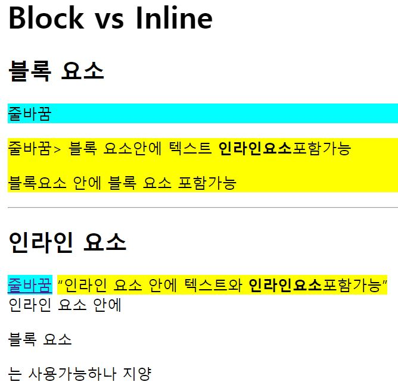

# 2023_01_20.md
간단하게 html에 대해서 정리를 하기로 했다.

## html
> HTMl은 Hyper Text Markup Language의 약자이다.
* 하이퍼 텍스트: 하이퍼 링크를 이용해 독자가 원하는 순서에 따라 기존 문서에서 다른 문서로 접근할 수 있는 텍스트이다.
* 마크업 언어: Mark Up이란 어떠한 표시를 뜻한다. 마크업 언어는 태그를 이용해서 문서나 데이터의 구조를 명시하는 언어이다.
### 블록 요소 & 인라인 요소
* 블록요소
  * display 속성 값이 블록인 요소이다.
  * 새로운 라인에서 시작하며, 해당 라인의 모든 너비를 차지한다.

* 인라인 요소
  *  display 속성값이 인라인인 요소이다.
  *  새로운 라인에서 시작하지 않고, 요소의 너비도 해당 라인 전체가 아닌 해당 html 요소의 내용 만큼만 차지한다.
### 태그
* 웹 문서의 유형을 html로 지정
    > `<!DOCTYPE html>`
* 문서를 html로시작, 언어는 영어로 지정
    > `<html lang="en">` 
* 주로 브라우저의 정보를 입력
* 메타 데이터 입력
    > `<meta charset="UTF-8">`
* 문서의 제목
    >`<title>Document</title>`
* 문서의 내용
    > `<body></body>`
* 레이아웃 나누기
    > `<div></div>`
* 제목(숫자에 따라 크기달라진다.)
    > `<h1></h1>,<h2></h2>...`
* 단락
    > `<p></p>`
* 줄바꿈
    > `<br>`
* 텍스트를 굵게 강조
    > `<strong></strong>`
* 인라인 요소 묶기
    > `<span></span>`

### 위의 태그들을 활용한 간단한 실습
* 소스 코드
``` html
    <!DOCTYPE html> 
    <html lang="en">
    <head>
        <meta charset="UTF-8">
        <meta http-equiv="X-UA-Compatible" content="IE=edge">
        <meta name="viewport" content="width=device-width, initial-scale=1.0">
        <title>Document</title>
    </head>
    <body>
        <h1>Block vs Inline</h1>
        <h2>블록 요소</h2>
        <P style = "background-color : aqua">줄바꿈</P>
        <div style ="background-color : yellow">줄바꿈>
            블록 요소안에 텍스트 <strong>인라인요소</strong>포함가능
            <P>블록요소 안에 블록 요소 포함가능</P>
        </div>
        <br>


        <h2>인라인 요소</h2>
        <a href =""style = "background-color : aqua">줄바꿈</a>
        <q style ="background-color : yellow">인라인 요소 안에 텍스트와 <b>인라인요소</b>포함가능</q>
        <br>
        <span>인라인 요소 안에 <p>블록 요소</p>는 사용가능하나 지양</span>
    </body>
    </html>
```
* 햐결과

