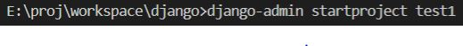
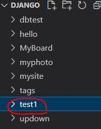
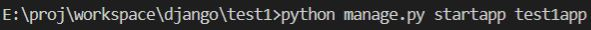
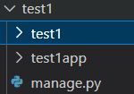
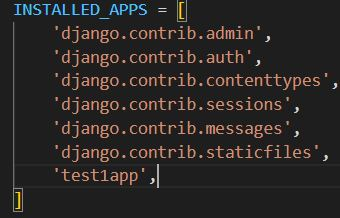

# 2023_02_02

## django
* djnago는 파이썬 기반의 웹 풀스택 프레임 워크
* 프론트 엔드 부분이 부실하여 실제 서비스에 활용되기에는 부족함
* 배우기 시작하는 사람들한테 적합함(난 초보자니깐)

### django 프로젝트와 앱
* 프로젝트
  * 프로젝트는 하나의 큰서비스라고 보면 됨
  * 하나의 웹 사이트가 하나의 프로젝트라고 생각
* 앱
  * django에서 프로젝트 내 기능을 일정한 기준으로 나눠 놓은 단위
  

### django 시작하기
* django-amdin startproject `"프로젝트명"`

|명령어|결과|
|---|---|
|||

* python manage.py startapp `"앱이름"`

|명령어|결과|
|---|---|
|||

* django - setting.py 설정
  * installed_apps에 추가로 만든 앱 test1app를 등록한다

