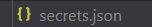
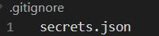
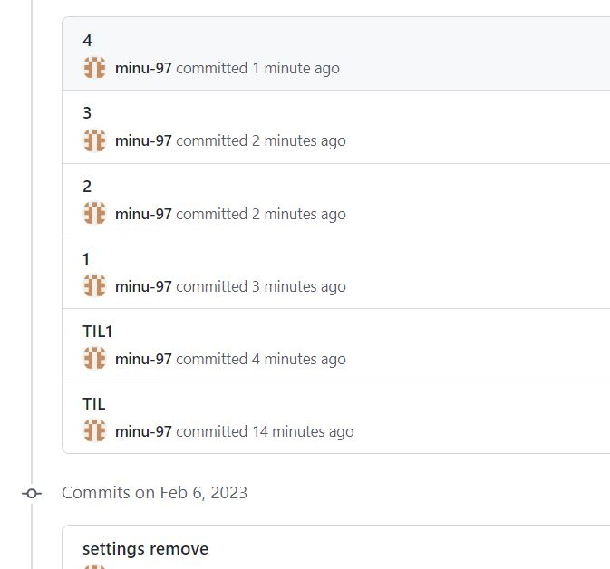
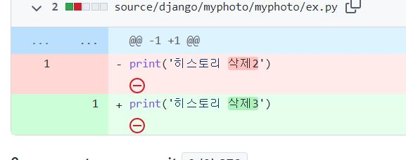
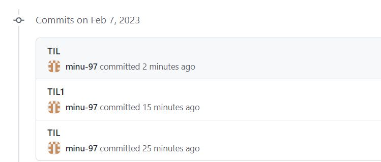

# 2023_02_06

# django 실습
## [source code](./source/django/myphoto/)
> django 소스코드를 커밋하고 몇분 지나서  보안성에 위배되어서 공유하면 안되는 시크릿키 또한 같이 커밋이 된 것을 알게 되었다.

## 해결방안
> 해결방안에 대해서 알아보았는데 커밋 전에 해야할 예방 조치와 커밋 후 할 수 있는 방법에 대해 알게 되었다.
### gitignore 이용
> git 에서 커밋 후 등록을 할 때 무시할 파일을 지정해줄 수 있는 gitignore을 사용하여 예방하는 방법에 대해 알아보자.

1. 자신의 프로젝트 폴 더 중 최상위 폴더 아래에 json파일을 생성한다.
ex) secreate.json



2. json 파일안에 아래와 같이 작성해준다.
  
```json 
{
    "SECRETE_KEY" : "시크릿 키"
}
```

3. 자신으 프로젝트 폴더안의 settings.py 파일에 아래와 같이 시크릿키 부분에 작성해준다.
  
```python
import os, json
from django.core.exceptions import ImproperlyConfigured

BASE_DIR = Path(__file__).resolve().parent.parent


secret_file = os.path.join(BASE_DIR, 'secrets.json')  # secrets.json 파일 위치를 명시, 파일명을 임의로 작성했을 시 변경해줘야한다.

with open(secret_file) as f:
    secrets = json.loads(f.read())

def get_secret(setting):
    """비밀 변수를 가져오거나 명시적 예외를 반환한다."""
    try:
        return secrets[setting]
    except KeyError:
        error_msg = "Set the {} environment variable".format(setting)
        raise ImproperlyConfigured(error_msg)


SECRET_KEY = get_secret("SECRET_KEY")
```

4.  `.gitignore` 파일 생성하고 안에 자신이 제외시키고 싶은 파일명을 작성한다. 이때 `.gitignore`와 `.git`은 같은 폴더여야한다.

5. 이제  비활성화된 모습을 볼 수 있고 add후 커밋을 하면 json파일이 제외된 상태로 업로드 되는 것을 확인 할 수 있다.

### 커밋 후 방법
#### 나의 경우와 같이 이미 몇차례 커밋을 한 상태면 깃에서 제공하는 명령어를 통해 해결해야한다.

1. 파일을 삭제 했으나 커밋을한 히스토리가 남아있어 확인이 가능하다
   |히스토리|히스토리내용|
   |---|---|
   |||

2. 이때 히스토리까지 삭제하기 위해서는 제공되는 git filter-branch명령을 사용하면

```bash
    $ git filter-branch --force --index-filter "git rm  --cached --ignore-unmatch  [해당 파일 경로 와 이름]" --prune-empty --tag-name-filter cat -- --all   
```
3. 파일 경로와 이름에 `"source/django/myphoto/myphoto/ex.py"` 아래와 같이 파일이 저장된 경로와 파일의 이름을 입력해주면된다.

4.  모든 히스토리를 검색함으로 커밋내역이 많으면 시간이 오래 소요된다.

5. `git push --force` 를 통해서 강제로 푸쉬를 한 후 결과를 확인해 보면 <p></p>히스토리가 삭제된것을 확인 할 수 있다.

