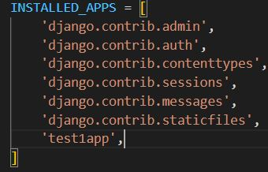

# 2023_02_07

## django 실습
> django 실습 [소스코드](./source/django/myphoto/) 에 대한 공부


1. 프로젝트 생성

* vscode의 cmd에 `django-admin startproject "프로젝트명"`을 입력해 프로젝트를 생성한다.
* `cd "프로젝트폴더명"` 으로 위치를 옮기고 `python manage.py startapp 'app명'`을 통해서 앱을 생성해 준다.

* settings.py 파일의 isntalled_apps에 생성한 app 등록, 사용할 데이터베이스 설정(<span style="font-size: 15px; text-decoration: underline">보완상 문제가 걱정되어서 현재 소스코드에서 삭제한 상태이다.</span>)




* 앱 폴더 내에 `templates` 폴더와 `urls.py`폴더를 생성해 준다.

* settings.py가 위치한 폴더 내의 urls.py 파일에 아래와 같이 입력해준다. `http://127.0.0.1/` 부터 앱내부의 urls를 이용한다는 의미이다.
  
  ```python
    from django.contrib import admin
    from django.urls import path, include

    urlpatterns = [
        path('admin/', admin.site.urls),
        path('',include('앱명.urls'))
        # http://127.0.0.1/~~~   => photo.urls
    ]
  ```
  * app을 생성하면 자동으로 models.py가 생성되는이 파일 내부에 class를 정의해주면 된다.

```python 
    from django.db import models
    from django.conf import settings

    # Create your models here.
    class Photo(models.Model):
        title = models.CharField(max_length=50)
        author = models.CharField(max_length=50)
        image = models.CharField(max_length=200)
        description = models.TextField()
        price = models.IntegerField()

        def __str__(self):
            return str(self.title)
```
* cmd창에 `python manage.py makemigrations` 와 `python manage.py migrate`로 모델의 생성이나 변경사항을 저장하고 DB에 적용한다.<P style="text-align:center"> </p>migrations 폴더 내에 0001.initial.py파일이 생성되었다.
  
