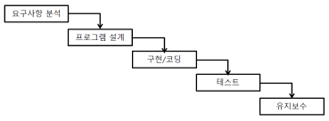
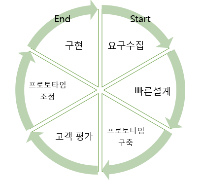
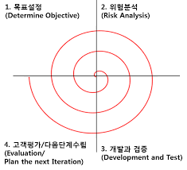
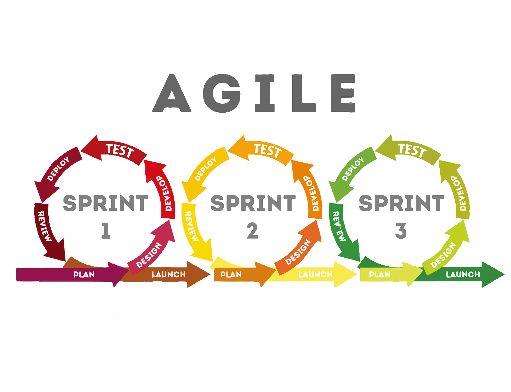
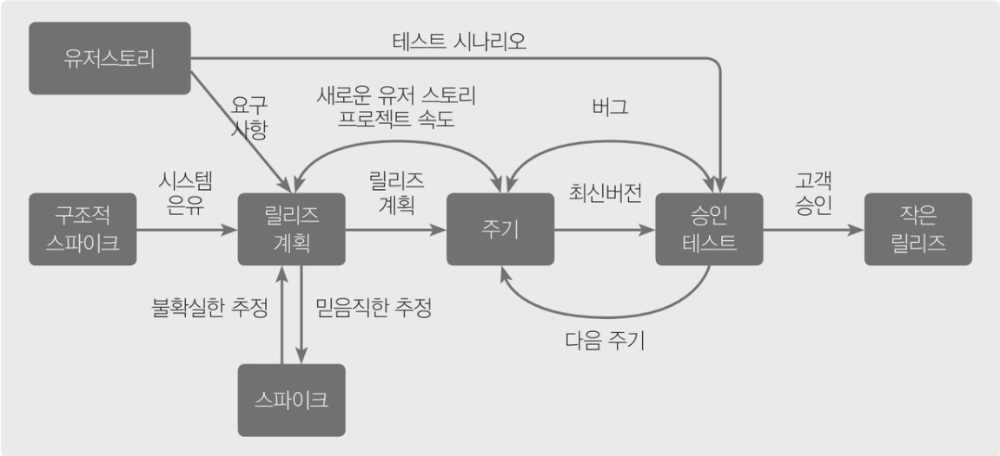

# 소프트 웨어 개발 방법론(Day -1)

생성일: 2023년 6월 26일 오후 2:03

# ① 소프트 웨어

## 1)사용 소프트웨어

1. 상용 소프트웨어 특징
    1. 상업적 목적이나 판매를 목적으로 개발되는 소프트웨어
    2. 소프트웨어 개발에 사용된 소스 코드는 배포하지 않음
    3. 다양한 형태의 라이선스를 이용하여 배포되며 기술 지원을 보증
    
2. 상용 소프트웨어 분류체계
    1. 상용 소프트 웨어는 범용과 특화 소프트웨어로 나뉨
        1. 산업 범용 소프트웨어 : 시스템 sw, 미들웨어, 응용sw
        2. 산업 특화 소프트웨어 : 자동차, 항공, 교육 물류 등의 산업 전용

## 2) 응용 소프트웨어

1. 응용 소프트웨어 특징
    1. 특정 업무를 처리하기 위한 목적으로 작성된 소프트웨어
    2. 애플리케이션, 응용 솔류션 및 서비스 등 다양한 이름으로 불린다
    
2. 응용 소프트웨어 분류체계
    1. 기업용 소프트웨어 : 오피스 웨어 , ERP, SCM, BI, CRM 등
    2. 영상 처리 소프트웨어 : 영상 인식, 스트리밍, 영상 편집 등
    3. CG/VR 소프트웨어 :  3D 스캐닝과 프린팅, 모델링, 가상현실, 홀로그램 등
    4. 콘텐츠 배포 소프트웨어 : 콘텐츠 보호, 관리, 유통 등
    5. 자연어 처리 소프트웨어 : 정보 검색과 질의 응답, 의사 결정 지원 언어 분석 등
    6. 음성처리 소프트웨어 : 음성 인식, 합성 처리 등
    
3. 기업용 소프트웨어 특성
    1. 오피스웨어 : 워드 , 엑셀, 그룹웨어 등의 일반 업무용
    2. ERP : 경영 활동 프로세스 통합 관리
    3. SCM : 물류의 흐름 파악 및 지원
    4. BI : 데이터를 황용하여 의사 결정 지원
    5. CRM : 고객 특성에 맞는 마케팅 활동 지원

## 3) 시스템 소프트웨어

1. 시스템 소프트웨어 정의
    1. 사용자가 손쉽고 효율적으로 컴퓨터 시스템을 사용하도록 돕는 소프트 웨어
    2. 하드웨어 제작사에서 제공되며 운영체제와도 같은 의미를 가짐
    
2. 시스텝 정의(기본 요소 포함)
    1. 컴퓨터 시스템과 같은 의미로 쓰이며, 특정 업무를 수행하기 위해 중앙처리 장치를 중심으로 구성된 하드웨어 및 소프트웨어의 총칭
    2. 컴퓨터 시스템의 
        1. 입력 : 시스템 처리가 필요한 데이터 제어 요소 등 전달
        2. 처리 : 입력된 값을 정해진 방식에 맞게 처리하여 결과를 도출
        3. 출력 : 처리 결과를 출력 장치 및 저장 장치로 전달
        4. 제어 : 데이터 처리를 위해 각 장치들의 기능 수행을 제어
        5. 피드백 : 기능 수행이 잘못된 경우 적절한 처리과정을 다시 반복
    
3. 시스템의 성능평가 기준
    1. 일반적으로 시스템의 목적은 아래 항목들을 만족시키는 것이다.
        1. 처리 능력(Throughput) : 단위 시간 내 작업 처리량
        2. 반환 시간 (Turnaround time) : 작업 의로부터 처리까지의 시간
        3. 사용 가능도 (Availability) : 필요할 때 즉시 사용 가능한 정도(가용성)
        4. 신뢰도 (Reliability) : 주어진 문제를 정확하게 해결하는 척도
        
4. 플랫폼 (flatform)
    1. 특정 시스템을 바탕으로 제공되는 운영체제 및 운영환경
    2. 기준에 따라 플랫폼의 범위가 달라질 수 있다.
        1. 응용 프로그램 관점에서의 플랫 폼 : 윈도우즈, 안드로이드 등
        2. 카카오톡 서비스 이용자 관점에서의 플랫폼 : 카카오톡
    3. 플랫폼의 성능을 측정하는 기준에는 가용성, 응답시간, 정확성, 사용률이 있다.
        1. 가용성 : 필요할 때 즉시 사용가능한 정도
        2. 응답 시간 (Response Time) : 명령에 반응하는 시간
        3. 정확성 (Accuracy)  : 처리 결과가 기대한 값과 비교해서 정확한지 측정
        4. 사용률 (Utilization) : 데이터 처리에 시스템 자원을 사용하는 정도

## 4) 소프트웨어 공학

1. 소프트웨어 공학의 정의
    1. 최소의 비용과 개발 기간을 통해 높은 품질의 소프트웨어를 도출하기 위한 모든 수단과 도구를 총칭
    2. 소프트웨어 개발의 품질과 생산성의 향상을 목표로 연구하는 학문
    3. 소프트웨어 공학의 목적은 아래와 같다
        1. 소프트웨어 개발에 필요한 비용과 기간 예측
        2. 하드웨어에 대한 소프트웨어의 상대적 비용 절감
        3. 급속하게 발전하는 하드웨어, 소프트웨어 기술 반영
        
2. 소프트웨어 공학의 기본 원칙
    1. 현대적인 프로그래밍 기술을 지속적으로 적용한다
    2. 소프트웨어 개발 단계별 산출물에 대한 명확한 기록을 유지

## 5) 소트트웨어 개발 프레임 워크

1. 모듈(Module)
    1. 프로그램을 기능별로 분할하여 재사용이 가능하게끔 부품화
    2. 개발자가 프로그램의 기본틀을 제공하고 모듈을 활용하여 기능을 구체화
    
2. 라이브러리 (Library) 
    1. 툴킷이라고도 하며, 관련 있는 모듈들을 모아 놓는 것
    2. 라이브러리에 존재하는 각 모듈이 반드시 독립적인 것은 아님
        1. 표준 라이브러리 : 프로그래밍 언어에 내장
        2. 외부 라이브러리 : 별도의 설치를 통해 사용
        
3. 디자인 패턴(Design Pattern)
    1. 특정 기능에 대한 문제해결을 위한 추상적인 가이드 라인을 제시한 것
    2. 프로그램의 세부적인 구현 방안을 위해 참조하는 해결 방식을 제시 한 것
    
4. 소프트웨어 개발 프레임워크(Frame Work)
    1. 디자인 패턴에 모듈의 장점 및 기능을 결합하여 실제적인 개발의 틀(Frame) 제공
    2. 프레임워크가 프로그램의 기본 틀을 제공, 개발자가 기능을 구체화하는 제어의 역 흐름이 발생
    3. 프로그램의 기반, 구조를 잡아주는 코드의 모임이며, 자연스럽게 특정 디자인 패턴을 유도
    4. 이미 검증된 프레임워크를 사용함으로써 품질, 예산, 유지보수에 이점
    5. 프로그램 구성의 복잡도가 감소하여 상호 운용성과 개발 및 변경이 용이
    
5. 소프트웨어 아키텍쳐(Architecture)
    1. 다수의 프레임워크를 체계적으로 구성, 설명하는 구조체를 말함
    2. 소프트웨어의 설계와 업그레이드를 통제하는 지침과 원칙을 제공
    
6. 컴포넌트(Component)
    1. 모듈의 형태로 재사용 가능한 확장된 소프트웨어 블럭
    2. 일반적인 코딩을 벗어나 마치 레고(블럭)를 쌓아 올리듯이 개발하는 기법
    3. 프레임워크 및 아키텍쳐가 적용되어 있어 안정적
    4. 협약에 의한 설계를 따를 경우에 포함되어야 할 조건은 아래와 같음
        1. 선행조건 : 컴포넌트 오퍼레이션 사용 전에 참이어야 하는 조건
        2. 결과조건 : 컴포넌트 오퍼레이션 사용 후에 참이어야 하는 조건
        3. 불변조건 : 컴포넌트 오퍼레이션 실행 중에 참이어야 하는 조건
        
7. 재사용 가능한 소프트웨어 요소
    1. 소프트웨어의 부분 또는 전체 영역을 모두 재사용 요소로 볼 수 있음
    2. 부분적인 코드뿐 아니라 응용된 지식과 데이터 구조도 재사용 가능한 요소에 포함
    3. 개발 이후의 테스트 계획, 문서화 방법 및 절차 등도 재사용 가능 요소
    
8. 소프트웨어 재사용 방법
    1. 소프트웨어를 재사용하는 방법
        1. 합성(Composition) 중심 : 모듈을 조립하여 소프트웨어를 완성 블록 구성 방식
        2. 생성(Generation) 중싱 : 추상적인 명세를 구체화하여 소프트웨어를 완성 패턴 구성 방식

# ② 소프트웨어 개발 수명 주기

## 1) 소프트웨어 개발 수명 주기

- 소프트웨어 개발 수명 주기 정의
    - 소프트웨어 개발 방법론의 바탕
    - 소프트웨어 개발 과정을 단계별로 구성한 것으로 단계별 산출물이 존재
    
- 폭포수(Waterfall) 모델
    - 과거에 가장 폭넓게 사용되던 방식
    - 정해진 단계를 한 번씩만 진행하며 이전 단계로 돌아갈 수 없음
    - 단계별로 결과물이 명확하게 산출되어야 다음 단계로 넘어가는 방식
    - 제품의 기능 보완이 불가능하므로 메뉴얼 작성이 필수적
    
    
    
- 프로토타입(Prototype)모델
    - 폭포수 모델의 단점을 보완한 모델로 시제품(prototype)을 통해 최종 결과물을 예측
    - 시제품은 사용자와 시스템 사이의 인터페이스에 중점을 두어 개발
    - 시제품은 추후 최종 구현 단계에서 골격으로 사용
    
    
    
- 나선형(Spiral) 모델
    - 폭포수 모델과 프로토타입 모델의 장점에 위험 분석기능을 더한 모델
    - 개발 중 발생할 수 있는 위험을 최소화 하는 것이 목저이며 유지보수가 필요
    - 개발 중 발생할 수 있는 위험을 최소화하는 것이 목적이며 유지보수가 필요
    - 누락 및 추가된 요구사항 반영
    
    
    
- 애자일 모델
    - 소프트웨어를 사용할 고객과의 소통에 중심을 둔 방법론의 통칭
    - 짧은 개발 주기를 반복하면서 고객의 피드백을 소프트웨어에 반영
    - 고객과의 소통을 통해 작업의 우선순위를 지정하여 개발 진행
    - 애자일 모델을 기반으로 하는 개발 모델 Scrum, XP, Kanban, crystal, FDD(기능 주도 개발), ASD(적응형 소프트웨어 개발), DSDM(동적 시스템 개발) 등
    - 절차, 문서, 계획보다 소통, 협업, 변화 대응에 가치를 둠

## 2) 스크럼 모델

- 스크럼 모델 특징
    - 스크럼 팀을 구성하여 팀을 중심으로 개발의 효율성을 높이는 개발 모델
    - 제품 책임자와 스크럼 마스터, 개발팀으로 구성
    - 반복적인 스프린트를 통해 제품을 완성
        - 스프린트(sprint) : 2 ~ 4주 정도의 기간 내에서 하나의 task를 개발하는 과정
        - 태스크(task) : 개발 요구사항(사용자 스토리)을 개발자(팀)별로 나눈 것
    - 스크럼의 가치는 화약, 전념, 정직, 존중, 용기 등

- 제품 책임자(Product Owner)
    - 목표 제품에 대한 책임을 지고 의사를 결정하는 역할 당담
    - 이해관계자(Stakeholder)들의 의견을 종합하여 요구사항을 백로그에 작성하고 우선순위를 조정
        - 제품 백로그(backlog) : 우선 순위에 따라 개발에 필요한 사용자 스토리 나열
        - 스프린트 백로그 : 해당 스프린트에서 개발해야 할 태스크를 나열한 목록
        - 사용자 스토리 : 사용자 요구사항을 단어의 나열이 아닌 이야기(시나리오)의 형태로 표현
        - 릴리즈 계획 : 제품 백로그에 작성된 사용자 스토리를 기반으로 전체 개발 일정 수립
    - 팀원들은 백로그에 스토리 추가만 가능하고 우선순위 조정은 불가능

- 스크림 마스터(Scrum Master)
    - 개발팀원들의 원활한 업무를 위한 가이드 역할 당담
    - 일일 스크럼 회의를 주관할 수 있으며 개발 과정에서 발생된 장애 요소를 공론화하여 해결할 수 있도록 처리
    - 스크럼 마스터의 역할은 팀원들이 상황에 유연하게 대응할 수 있도록 조력하는 역할이며 통제의 권한이 없음

- 개발팀(Development Team)
    - 제품 책임자와 스크럼 마스터를 제외한 모든 개발에 참여하는 인원
    - 개발팀에는 개발자뿐 아니라 디자이너와 테스터 등도 포함
    - 개발팀원들은 능동적으로 팀을 구성하고 문제를 해결 할 수 있어야 한다

- 스크럼 모델 개발 프로세스
    - 스크럼 모델 개발 프로세스는 아래와 같다
    
    
    
    - 스프린트 계획 회의 : 스프린트 백로그 작성, 개발일정 수립
    - 스프린트 진행 : 백로그에 기록된 태스크를 당담 개발자에게 할당
    - 일일 스크럼 회의 : 짧은 시간 동안 소멸차트를 통해 진행 상황 점검, 태스크 상황에 따라 할 일, 진행 중, 완료의 상태로 변경
    - 스프린트 검토 회의 : 사용자와 함께 개발이 완료된 부분 또는 전체  제품을 테스트하고 피드백을 제품 백로그에 반영
    - 스프린트 회고: 스프린트 진행 자체의 문제점, 개선점 도출

## 3) XP(eXtreme Programming) 모델

- XP 모델 특징
    - 고객의 참여와 짧은 개발 과정의 반복을 극대화하여 개발 생산성을 높이는 개발 모델
    - 소규모 인원으로 진행하는 프로젝트에 효과적이며 단계별 단순한 설계를 통해 개발 속도를 향상시킴
    - XP의 가치는 의사소통, 단순성, 용기, 존중, 피드백

- XP 모델 개발 프로세스
    - 사용자 스토리에 기록된 내용을 바틍으로 릴리즈 계획을 수립, 분석된 스토리에 따라 스파이크 또는 이터레이션을 진행
        - 소규모 릴리즈 : 기능별로 고객의 피드백을 받을 수 있도록 릴리즈의 규모를 작게 분할
        - 스파이크 : 특징 기술의 확인을 위해 다른 모든 조건을 무시하고 간단하게 개발하는 프로그램
        - 이터레이션 : 하나의 릴리즈를 1~3주의 개발 기간으로 세분화한 단위
    - 스파이크를 통해 기술이 검증되면 해당 부분을 이터레이션으로 전달
    - 이터레이션 진행 도중에서 새로운 스토리가 작성될 수 있음
    - 이터레이션을 통해 부분 완료된 제품을 고객이 직접 사용자 스토리에 포함된 테스트 사항을 통해 승인 검사 수행
    - 테스트 과정에서 새로운 요구사항, 오류 등이 발견되면 다음 이터레이션에 반영
    
    
    
- XP 기본 원리
    - XP의 실천 사항은 12개 항목으로 나뉜다

| 항목 | 설명 |
| --- | --- |
| Planning Game | 게임처럼 선수, 규칙, 목표 등을 설정하여 계획 수립 |
| Small Releases | 짧은 주기의 릴리즈 고객의 피드백 최대화 |
|  System Metaphor | 개발 과정에서 최종 목표 시스템의 구조를 조망 |
| Simple Design | 가능한 가장 단순한 설계 |
| Test Driven Development | 우선 단위 테스트 이후 실제 코드 작성 |
| Design improvement | 기능을 유지하면서 코드 개선 작업 수행 |
| Pair Programming | 2명의 개발자가 코딩, 리뷰 공동 수행 |
| Collective Ownership | 시스템의 코드는 언제나 개발자 누구나 수정 가능 |
| Continous Intergration | 항상 빌드 및 배포가 가능한 상태 유지 |
| Sustainable Pace | 주당 일정 시간 이상을 일하지 않도록 오버타임 지양 |
| Whole Team | 개발 효율을 위해 고객을 프로젝트 팀원으로 상주시킴 |
| Coding standards | 원할한 의사소통 위해 표준화된 관례에 따라 코드 작성 |