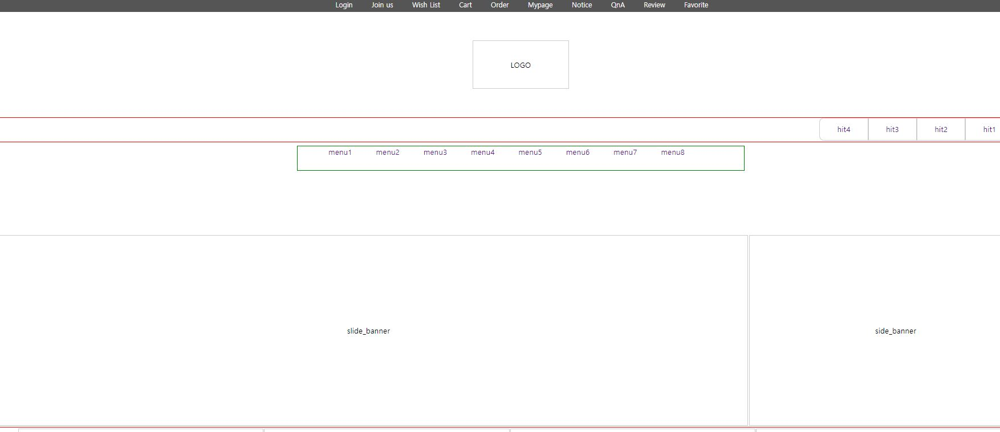

# html 실습
> html과 css의 간단한 실습을 해보았다.


## css사용
  * 외부에서 스타일 시트를 불러와서 적용
  * 내부에서 바로 작성해도 되나 가독성을 위해서 따로 작성함
```html
<head>
    <!-- 외부 스타일 시트에서 가져오기 -->
    <link rel="stylesheet" href="./resources/css/header.css">
    <link rel="stylesheet" href="./resources/css/content.css">
    <link rel="stylesheet" href="./resources/css/footer.css">
</head>
```

## header 태그
* header 태그를 사용하고 그안에 div를 사용하여 구역을 나누었다.
### header > div
* 헤더 태크 안의 div에 각각의 class명을 부여하여 상부의 메뉴 로고 그 밑의 메뉴 구역을 세분화하여 구성했다.
```html
<header>
      <!-- div 태그의 class gnb  -->
        <div class="gnb"></div>
   <!-- div 태그의 class logo -->
        <div class="logo">LOGO</div>
    <!-- div 태그의 class hit_menu  -->
        <div class="hit_menu"></div>
   <!-- div 태그의 class lnb -->
        <div class="lnb"></div>
 </header>
```
### header 태그의 css
* 헤더 태그 내에 부여된 class를 사용
* border로 class의 범위를 확인
* 각각에 width,height 과 margin 값 등을 부여하여 구역을 나눔
* 태그 안에 사용된 리스트들을 `float`을 사용하여 정렬하여 꾸밈
  
## 사용된 소스코드
🔗[header.sss](./source/resources/css/header.css)

🔗[selector.sss](./source/resources/css/selector.sss)


🔗[footer.sss](./source/resources/css/footer.sss)

🔗[html](./source/2023_01_25_1.html)

## 결과
> 지금은 결과에 보더로 영역만 표시를 해둔 상태이다.
> 차후 웹사이트 제작시 영역을 채워 꾸밀 수 있을 것이다.


🔗
🔗[결과](http://127.0.0.1:5501/source/2023_01_25_1.html)
